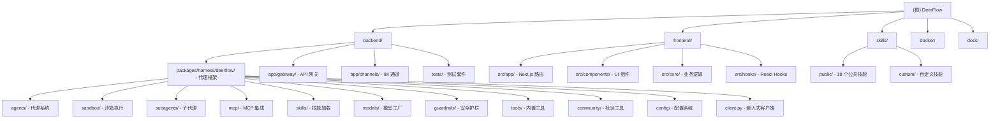

# DeerFlow - 开源超级代理系统

> **最后更新**: 2026-04-09
> **版本**: 2.0.0
> **语言**: Python 3.12+ | TypeScript 5.8
> **仓库**: [bytedance/deer-flow](https://github.com/bytedance/deer-flow)

---

## 项目愿景

DeerFlow (**D**eep **E**xploration and **E**fficient **R**esearch **Flow**) 是一个开源的**超级代理系统**，能够协调**子代理**、**记忆**和**沙箱**来完成几乎任何任务 —— 由**可扩展技能**驱动。

从深度研究框架开始，DeerFlow 已经演变为一个完整的代理运行时，为代理提供完成工作所需的基础设施：文件系统、记忆、技能、沙箱执行以及规划和生成子代理进行复杂多步骤任务的能力。

### 核心特性

- **技能 & 工具**: 可扩展的技能系统和工具集成（tool_search 延迟加载 MCP 工具）
- **子代理**: 动态生成和并行执行子代理（ACP Agent Tool 支持外部代理）
- **沙箱 & 文件系统**: 隔离的执行环境（本地/Docker/K8s），完整的文件系统访问
- **上下文工程**: 智能上下文管理和摘要，循环检测（LoopDetectionMiddleware）
- **长期记忆**: 跨会话的持久化记忆，可配置存储抽象（storage_class）
- **MCP 集成**: 支持 Model Context Protocol 服务器（stdio/SSE/HTTP，含 OAuth）
- **IM 通道**: Telegram、Slack、Feishu/Lark 集成（流式更新、文件附件上传）
- **安全护栏**: Guardrails 中间件，工具调用前授权（可插拔 provider）
- **嵌入式客户端**: DeerFlowClient 支持无 HTTP 直接调用

---

## 架构总览

DeerFlow 采用**前后端分离**的微服务架构：

```
┌─────────────────────────────────────────────────────────────────┐
│                         nginx (端口 2026)                        │
│                    统一入口、反向代理、静态资源                    │
└─────────────────────────────────────────────────────────────────┘
                              │
                ┌─────────────┴─────────────┐
                │                           │
                ▼                           ▼
┌───────────────────────────┐   ┌───────────────────────────┐
│   Frontend (Next.js 16)   │   │   Backend Services        │
│   - React 19              │   │   - LangGraph Server      │
│   - TypeScript 5.8        │   │   - Gateway API           │
│   - TanStack Query        │   │   - Python 3.12+          │
│   - Vercel AI SDK         │   │   - FastAPI               │
└───────────────────────────┘   └───────────────────────────┘
                                        │
                    ┌───────────────────┼───────────────────┐
                    │                   │                   │
                    ▼                   ▼                   ▼
            ┌───────────┐       ┌───────────┐       ┌───────────┐
            │  Agents   │       │  Sandbox  │       │    MCP    │
            │ LangGraph │       │  Docker   │       │  Servers  │
            │           │       │  Local    │       │           │
            └───────────┘       └───────────┘       └───────────┘
```

### 服务端口

| 服务 | 端口 | 描述 |
|------|------|------|
| **LangGraph Server** | 2024 | 代理运行时和工作流执行 |
| **Gateway API** | 8001 | REST API：模型、MCP、技能、记忆、工件、上传、线程清理 |
| **Provisioner** | 8002 | 沙箱配置（可选，仅 K8s 沙箱模式） |
| **Frontend** | 2026 | Web 界面（通过 nginx 统一暴露） |

---

## 模块结构图



---

## 模块索引

| 模块 | 路径 | 语言/框架 | 职责 | 文档覆盖率 |
|------|------|-----------|------|------------|
| **Backend - Harness** | `backend/packages/harness/` | Python 3.12+<br>LangGraph + LangChain | 代理框架（deerflow.*），可发布包 | [98%+](./backend/CLAUDE.md) |
| **Backend - App** | `backend/app/` | Python 3.12+<br>FastAPI | Gateway API + IM 通道集成（app.*） | [98%+](./backend/CLAUDE.md) |
| **Frontend** | `frontend/` | TypeScript 5.8<br>Next.js 16 + React 19 | Web 界面、流式对话、工件预览 | [95%+](./frontend/CLAUDE.md) |
| **Skills** | `skills/` | Markdown | 可扩展技能定义和模板（18 个公共技能） | 100% |

### Backend 子模块

#### Harness 层 (`packages/harness/deerflow/`)

| 子模块 | 路径 | 职责 |
|--------|------|------|
| **Agents** | `agents/` | LangGraph 代理工厂、中间件链（12 个中间件）、记忆系统 |
| **Sandbox** | `sandbox/` | 沙箱抽象接口、本地/Docker/K8s 提供者 |
| **Subagents** | `subagents/` | 子代理注册表、执行器、双线程池调度 |
| **MCP** | `mcp/` | MCP 服务器客户端、工具缓存、OAuth 支持 |
| **Skills** | `skills/` | 技能发现、加载、解析、安装 |
| **Models** | `models/` | LLM 模型工厂（thinking/vision 支持） |
| **Guardrails** | `guardrails/` | 工具调用前授权中间件、可插拔 provider |
| **Tools** | `tools/` | 内置工具（present_files、ask_clarification、view_image、task） |
| **Community** | `community/` | 社区工具（Tavily、Jina AI、Firecrawl、DuckDuckGo、AioSandbox、ACP） |
| **Config** | `config/` | 配置系统（版本管理、热重载、环境变量解析） |
| **Client** | `client.py` | 嵌入式 Python 客户端（DeerFlowClient） |

#### App 层 (`app/`)

| 子模块 | 路径 | 职责 |
|--------|------|------|
| **Gateway** | `gateway/` | FastAPI REST API（模型、MCP、技能、记忆、上传、工件、线程清理） |
| **Channels** | `channels/` | IM 通道集成（Telegram/Slack/Feishu），消息总线 |

### Frontend 子模块

| 子模块 | 路径 | 职责 |
|--------|------|------|
| **App Router** | `src/app/` | Next.js App Router 结构 |
| **Components** | `src/components/` | UI 组件（ai-elements、ui、workspace、landing） |
| **Core** | `src/core/` | 业务逻辑（threads、api、artifacts、memory、i18n、models、agents、skills、mcp、settings、config、tasks、uploads、streamdown、notification） |
| **Hooks** | `src/hooks/` | 共享 React Hooks（mobile、global-shortcuts） |

---

## 运行与开发

### 前置要求

- **Node.js**: 22+ (前端)
- **Python**: 3.12+ (后端)
- **pnpm**: 10.26.2+ (前端包管理)
- **uv**: 最新版 (Python 包管理)
- **Docker**: 可选，用于沙箱执行

### 快速开始

#### 1. 生成配置文件

```bash
make config
```

这会从 `config.example.yaml` 创建 `config.yaml`，从 `.env.example` 创建 `.env`。

#### 2. 配置模型

编辑 `config.yaml`，至少配置一个模型：

```yaml
models:
  - name: gpt-4                       # 内部标识符
    display_name: GPT-4               # 显示名称
    use: langchain_openai:ChatOpenAI  # LangChain 类路径
    model: gpt-4                      # API 模型标识
    api_key: $OPENAI_API_KEY          # API 密钥（推荐使用环境变量）
    max_tokens: 4096
    temperature: 0.7
```

#### 3. 设置 API 密钥

编辑 `.env` 文件：

```bash
TAVILY_API_KEY=your-tavily-api-key
OPENAI_API_KEY=your-openai-api-key
# 根据需要添加其他提供商密钥
INFOQUEST_API_KEY=your-infoquest-api-key
```

#### 4. 启动服务

**方式 A: Docker 开发（推荐）**

```bash
make docker-init    # 拉取沙箱镜像（仅需一次）
make docker-start   # 启动服务（自动检测沙箱模式）
```

访问: http://localhost:2026

**方式 B: 本地开发**

```bash
make check          # 检查工具安装
make install        # 安装依赖
make dev            # 启动所有服务（热重载）
```

访问: http://localhost:2026

### 开发命令

| 命令 | 描述 |
|------|------|
| `make config` | 生成配置文件 |
| `make check` | 检查必需工具 |
| `make install` | 安装所有依赖 |
| `make dev` | 开发模式启动（热重载） |
| `make stop` | 停止所有服务 |
| `make clean` | 清理临时文件和容器 |
| `make docker-start` | Docker 开发模式 |
| `make up` | 生产模式 Docker 部署 |
| `make down` | 停止生产 Docker 容器 |

### 生产部署

```bash
make up     # 构建镜像并启动生产服务
make down   # 停止并移除容器
```

---

## 测试策略

### Backend 测试

**框架**: pytest

**运行测试**:

```bash
cd backend

# 所有测试
make test

# 特定测试文件
PYTHONPATH=. uv run pytest tests/test_client.py -v

# 带覆盖率
PYTHONPATH=. uv run pytest --cov=src tests/
```

**测试覆盖**:

- **29 个测试文件**，**77+ 个单元测试**
- 关键测试套件：
  - `test_client.py` - 嵌入式客户端和 Gateway 一致性
  - `test_memory_*.py` - 记忆系统
  - `test_mcp_*.py` - MCP 集成和 OAuth
  - `test_subagent_*.py` - 子代理执行
  - `test_title_*.py` - 标题生成
  - `test_uploads_*.py` - 文件上传
  - `test_docker_sandbox_mode_detection.py` - Docker 沙箱模式检测

### Frontend 测试

当前**未配置测试框架**。

建议添加：
- **Vitest** - 单元测试
- **Playwright** - E2E 测试
- **React Testing Library** - 组件测试

---

## 编码规范

### Python (Backend)

- **Line length**: 240 字符
- **Type hints**: 必需
- **Quotes**: 双引号
- **Import order**: 标准库 → 第三方 → 本地

**Linting**:

```bash
make lint      # 检查
make format    # 修复格式
```

### TypeScript (Frontend)

**Import order**（每组之间换行，组内字母排序）：

1. Built-in (`react`, `next`)
2. External (`@radix-ui`, `@tanstack`)
3. Internal (`@/core`, `@/components`)
4. Parent (`../`)
5. Sibling (`./`)

**最佳实践**:

- 使用内联类型导入: `import { type Foo }`
- 未使用变量前缀: `_variable`
- 类名: 使用 `cn()` from `@/lib/utils`
- 路径别名: `@/*` → `src/*`

**检查**:

```bash
cd frontend

pnpm typecheck    # 类型检查
pnpm lint         # ESLint
pnpm check        # 全部检查
```

---

## AI 使用指引

### 适合 AI 辅助的任务

1. **添加新技能**: 在 `skills/custom/` 创建新的 Markdown 技能文件
2. **集成新工具**: 在 `packages/harness/deerflow/community/` 添加新工具实现
3. **添加 IM 通道**: 在 `app/channels/` 实现新的通道适配器
4. **创建自定义代理**: 基于现有中间件创建新的代理配置
5. **扩展前端组件**: 在 `src/components/workspace/` 添加新的 UI 组件
6. **添加安全护栏**: 在 `config.yaml` 配置 guardrails provider

### 关键概念

#### 虚拟路径系统

**Agent 看到的路径**:
- `/mnt/user-data/workspace` - 工作目录
- `/mnt/user-data/uploads` - 用户上传
- `/mnt/user-data/outputs` - 输出文件
- `/mnt/skills` - 技能目录
- `/mnt/acp-workspace/` - ACP 代理工作空间（只读）

**物理路径**:
- `backend/.deer-flow/threads/{thread_id}/user-data/workspace`
- `backend/.deer-flow/threads/{thread_id}/user-data/uploads`
- `backend/.deer-flow/threads/{thread_id}/user-data/outputs`
- `backend/.deer-flow/threads/{thread_id}/acp-workspace/` - ACP 代理工作空间
- `skills/` (项目根目录)

#### Harness / App 分层

后端采用严格分层架构：
- **Harness** (`packages/harness/deerflow/`): 可发布的代理框架包（`deerflow.*`），包含代理编排、工具、沙箱、模型、MCP、技能、配置等
- **App** (`app/`): 应用层代码（`app.*`），包含 Gateway API 和 IM 通道集成
- **依赖规则**: App 可导入 deerflow，但 deerflow 不可导入 app（由 `test_harness_boundary.py` 在 CI 中强制检查）

#### 中间件链

中间件按严格顺序执行（`packages/harness/deerflow/agents/lead_agent/agent.py`）:

1. **ThreadDataMiddleware** - 创建每线程目录
2. **UploadsMiddleware** - 跟踪上传文件
3. **SandboxMiddleware** - 获取沙箱实例
4. **DanglingToolCallMiddleware** - 处理不完整的工具调用
5. **GuardrailMiddleware** - 工具调用前授权（可选，可插拔 provider）
6. **SummarizationMiddleware** - 上下文缩减（可选）
7. **TodoListMiddleware** - 任务跟踪（可选）
8. **TitleMiddleware** - 自动生成标题
9. **MemoryMiddleware** - 记忆更新队列
10. **ViewImageMiddleware** - 注入 base64 图片
11. **SubagentLimitMiddleware** - 强制并发限制（可选）
12. **ClarificationMiddleware** - 处理澄清请求（必须最后）

另有 **LoopDetectionMiddleware** 用于打断重复的工具调用循环。

#### 技能系统

技能是**延迟加载**的 Markdown 文件，定义：
- 工作流程
- 最佳实践
- 参考资源

**位置**:
- 公共技能: `skills/public/*/SKILL.md`（18 个内置技能）
- 自定义技能: `skills/custom/*/SKILL.md`

**内置公共技能列表**:
- `bootstrap` - 系统引导
- `chart-visualization` - 图表可视化
- `claude-to-deerflow` - DeerFlow API 集成
- `consulting-analysis` - 咨询分析
- `data-analysis` - 数据分析
- `deep-research` - 深度研究
- `find-skills` - 技能发现
- `frontend-design` - 前端设计
- `github-deep-research` - GitHub 深度研究
- `image-generation` - 图片生成
- `podcast-generation` - 播客生成
- `ppt-generation` - PPT 生成
- `skill-creator` - 技能创建器
- `surprise-me` - 随机创意
- `vercel-deploy-claimable` - Vercel 部署
- `video-generation` - 视频生成
- `web-design-guidelines` - Web 设计指南

---

## 常见问题 (FAQ)

### Q: 如何更改监听端口？

**A**: 编辑 `docker/nginx/nginx.local.conf`（本地开发）或 `docker/nginx/nginx.conf`（生产），修改 `listen` 指令。

### Q: 沙箱执行失败怎么办？

**A**:
1. 检查 Docker 是否运行: `docker ps`
2. 检查沙箱镜像是否拉取: `docker images | grep sandbox`
3. 查看日志: `make docker-logs`

### Q: 如何添加自定义模型？

**A**: 在 `config.yaml` 的 `models` 部分添加新配置，支持任何 OpenAI 兼容的 API。

### Q: 记忆数据存储在哪里？

**A**: 默认 `backend/.deer-flow/memory.json` - 本地文件存储，完全由你控制。支持通过 `config.yaml` 的 `memory.storage_class` 配置自定义存储后端。

### Q: 如何在生产环境部署？

**A**:
```bash
make up    # 构建生产镜像并启动
```
或参考 `docker/docker-compose.prod.yml`。

---

## 相关资源

### 官方文档

- **网站**: [deerflow.tech](https://deerflow.tech/)
- **GitHub**: [bytedance/deer-flow](https://github.com/bytedance/deer-flow)

### 技术文档

- [安装指南](Install.md) - 详细的安装和设置指南
- [贡献指南](CONTRIBUTING.md) - 开发环境设置和工作流
- [配置指南](backend/docs/CONFIGURATION.md) - 详细配置说明
- [架构文档](backend/docs/ARCHITECTURE.md) - 技术架构详解
- [API 文档](backend/docs/API.md) - API 参考
- [安全护栏](backend/docs/GUARDRAILS.md) - Guardrails 配置和使用
- [文件上传](backend/docs/FILE_UPLOAD.md) - 文件上传功能
- [LangSmith 追踪](backend/docs/LANGSMITH.md) - 分布式追踪配置

### 模块文档

- [Backend 模块](backend/CLAUDE.md) - 后端架构和 API
- [Frontend 模块](frontend/CLAUDE.md) - 前端架构和组件

---

## 变更记录 (Changelog)

### 2026-04-09 - 增量更新（基于 147 个新提交）

**新功能**:
- **Exa 搜索集成**: 添加 Exa 作为社区工具提供商 (#1357)
- **vLLM provider**: 新增 vLLM 模型提供商支持 (#1860)
- **飞书文件接收**: IM 通道支持飞书文件接收功能 (#1608)
- **技能自我演化**: 实现技能自我演化和 skill_manage 流程 (#1874)
- **统一 serve.sh**: 统一服务启动脚本，支持 gateway 模式 (#1847)
- **新增公共技能**: academic-paper-review（学术论文审查）、code-documentation（代码文档）、newsletter-generation（ Newsletter 生成）(#1861)
- **BytePlus logo**: 添加 BytePlus 品牌标识 (#1948)

**重要修复**:
- **ClarificationMiddleware**: 正确处理字符串序列化选项 (#1997)
- **时区感知 UTC**: 内存模块使用时区感知 UTC，修复 pytest DeprecationWarnings (#1992)
- **子代理事件循环**: 修复 SubagentExecutor.execute() 中的事件循环冲突 (#1965)
- **循环检测稳定性**: 使用稳定键哈希工具调用 (#1911)
- **沙箱命令审计**: 增强复合分割和扩展模式的 bash 命令审计 (#1881)
- **子代理协作取消**: 为子代理线程添加协作取消支持 (#1873)
- **技能缓存刷新**: 使技能提示缓存刷新变为非阻塞 (#1924)
- **SQLite 优化**: 将 async SQLite mkdir 移出事件循环 (#1921)
- **前端安全性**: 修复无效 HTML 嵌套和 tabnabbing 漏洞 (#1904)
- **Docker 多阶段构建**: 使用多阶段构建从运行时镜像移除 build-essential (#1846)
- **ls_tool 输出截断**: 添加输出截断防止上下文窗口溢出 (#1896)

**前端改进**:
- **路由同步**: 避免 route new 作为 thread id，保持 DeerFlow 聊天 thread id 同步 (#1967, #1931)
- **历史请求**: 防止陈旧的 'new' thread id 触发 422 历史请求 (#1960)
- **UI 优化**: 修复 CSS 拼写错误、暗色模式边框和硬编码颜色 (#1942)
- **本地设置**: 统一本地设置运行时状态，从 LocalSettings 移除侧边栏布局 (#1879)
- **工件下载**: 修复工件下载操作边界和 lint 错误 (#1899)
- **建议芯片**: 修复建议芯片换行重叠输入问题 (#1895)
- **命令面板**: 修复 macOS 上命令面板 hydration 不匹配 (#1563)
- **智能体画廊**: 修复 bootstrap 创建后智能体画廊仍为空的问题 (#1934)

**后端改进**:
- **记忆去重**: 事实去重不区分大小写，正向强化检测 (#1804)
- **虚拟路径**: 保留虚拟路径分隔符样式 (#1828)
- **子代理限制**: 增加子代理最大轮次限制 (#1852)
- **Slack 用户 ID**: 规范化 Slack 允许的用户 ID (#1802)
- **soul 字段**: 在 GET /api/agents 列表响应中包含 soul 字段 (#1863)
- **Codex 输出**: 在 response.completed.output 为空时保留流式 Codex 输出 (#1928)
- **图片元数据**: 保留 viewed image reducer 元数据 (#1900)
- **流恢复**: 修复流恢复运行 (#1858)
- **客户端自定义事件**: 从 DeerFlowClient.stream() 暴露自定义事件 (#1827)

**Docker 和部署**:
- **恢复环境变量**: 恢复 gateway 环境变量并修复 langgraph 空参数问题 (#1915)
- **无效 .venv 恢复**: 恢复无效的 .venv 防止启动重启循环 (#1871)
- **LANGGRAPH_ALLOW_BLOCKING**: 修复命令语法 (#1891)
- **Shell 变量转义**: 转义生产 langgraph 命令中的 shell 变量 (#1877, #1880)
- **部署指导**: 澄清部署规模指导 (#1963)

**文档更新**:
- **修复断链**: 修复一些断开的链接 (#1864)
- **GitHub Copilot**: 更新 GitHub Copilot 指令

**依赖更新**:
- **uv.lock**: 更新依赖锁文件 (#1848)

### 2026-03-28 - 增量更新（基于 1655 个新提交）

**架构变更**:
- 后端重构为 Harness/App 分层：`packages/harness/deerflow/`（deerflow.*）+ `app/`（app.*）
- CI 强制边界检查：`test_harness_boundary.py`
- 配置版本管理：`config_version` 字段 + `make config-upgrade` 自动合并
- 配置热重载：基于 mtime 检测自动重新加载

**新功能**:
- GuardrailMiddleware：工具调用前授权，可插拔 provider（AllowlistProvider、OAP 等）
- LoopDetectionMiddleware：打断重复工具调用循环
- ACP Agent Tool：集成外部 ACP 兼容代理（invoke_acp_agent）
- tool_search：MCP 工具延迟加载
- 可配置记忆存储抽象（storage_class）
- DuckDuckGo 搜索集成（image_search + 搜索工具）
- GitHub PAT 配置支持
- Claude Code OAuth + Codex CLI 作为 LLM 提供商
- agent_name 注入：隔离记忆和自定义提示词
- soul.md bootstrap 命令
- Token 用量跟踪和显示
- 对话导出（Markdown/JSON）
- Cmd+K 命令面板和快捷键
- IM 通道增强：飞书单卡流式、文件附件上传、自定义 assistant ID
- 暗色模式支持
- Provisions 端口 8002（K8s 沙箱模式）
- 新增 5 个公共技能：claude-to-deerflow、chart-visualization、vercel-deploy-claimable、surprise-me、consulting-analysis

**路径变更**:
- `backend/src/` → `backend/packages/harness/deerflow/`（harness 层）
- `backend/src/gateway/` → `backend/app/gateway/`（app 层）
- `backend/src/channels/` → `backend/app/channels/`（app 层）
- `backend/src/community/` → `backend/packages/harness/deerflow/community/`

### 2025-03-13 - 初始化 AI 上下文文档（简体中文）

**覆盖统计**:
- 总文件数: 482
- 已扫描文件: 473
- 覆盖率: **98.1%** ✅

**生成内容**:
- ✅ 根级 `CLAUDE.md` - 项目概览和架构
- ✅ `backend/CLAUDE.md` - 后端模块文档（98%+）
- ✅ `frontend/CLAUDE.md` - 前端模块文档（95%+）
- ✅ `.claude/index.json` - 扫描索引和覆盖率报告

**扫描阶段**:
- **Phase A**: 识别 2 个主模块、17 个公共技能、5 个配置文件
- **Phase B**: 扫描 117 个后端文件、218 个前端文件、48 个技能文件、29 个测试文件
- **Phase C**: 深度扫描代理、网关、沙箱、中间件等关键文件

**主要发现**:
- 后端测试覆盖率高（29 个测试文件，77+ 测试用例）
- 前端未配置测试框架，建议添加 Vitest/Playwright
- 支持多种 LLM 提供商（OpenAI、Anthropic、DeepSeek、Google Gemini）
- 完整的 MCP 服务器集成，支持 OAuth
- 三个 IM 通道支持（Telegram、Slack、Feishu）

**技术栈**:
- **后端**: Python 3.12+、FastAPI、LangGraph、LangChain
- **前端**: TypeScript 5.8、Next.js 16、React 19、TanStack Query
- **AI**: LangGraph 1.0.6+、LangChain 1.2.3+
- **工具**: Tavily、Jina AI、InfoQuest、Firecrawl、DuckDuckGo

---

*此文档由 AI 自动生成和维护。如需更新，请运行文档生成脚本。*
